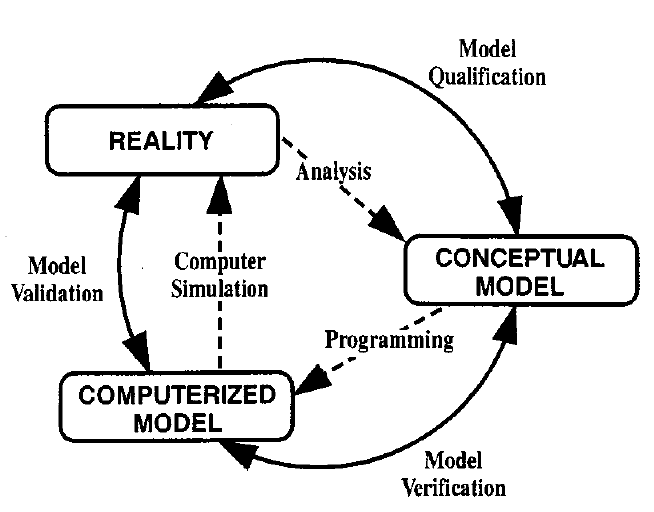
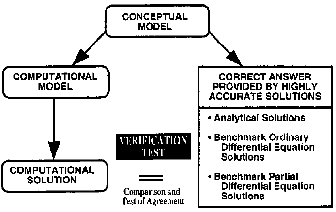
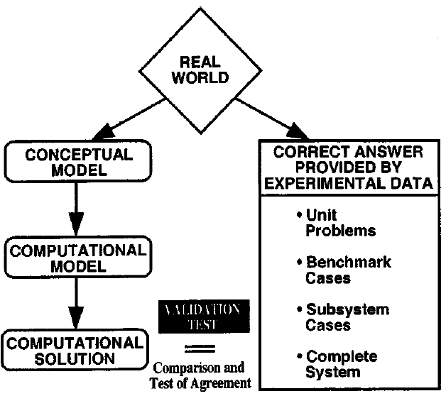

NEPC Verification and Validation Philosophy
===========================================

We use the standard definitions of verification and validation of
scientific code as described in [oberkampf2004]_

**Verification:** The process of determining that a model
implementation accurately represents the developer’s conceptual
description of the model and the solution to the
model, *including accuracy of the numerical solution.*

**Validation:** The process of determining the degree to
which a model is an accurate representation of the real world
from the perspective of the intended uses of the model.

**Figure 2.** Phases of modeling and simulation and the role of V&V from
[oberkampf2004]_.

Figure 2, a graphical representation from [schlesinger1979]_
and reproduced in [oberkampf2004]_, depicts the phases
of modeling and simulation and the role of V&V.
Two types of models are depicted in Figure 2: a conceptual
model and a computerized model. In the context of NEPC, there
are many conceptual models
composed of mathematical equations and associated parameters
that describe electron scattering processes
used to estimate cross sections and reaction rates.
The conceptual models also include all of the auxiliary
equations used such as rovibronic wavefunctions for diatomic molecules.
The computerized model is an operational computer
program (i.e. code) that implements a conceptual model.
The above figure clearly shows that the verification process
evaluates the accuracy with which the computerized model implements
the conceptual model
and that validation clearly deals with the
fidelity between the computerized model and experimental
measurements (i.e. the real world).

Verification
------------

The fundamental strategy of verification is to identify,
quantify, and reduce errors in the computational model and
its numerical solution. Figure 3 depicts the verification process
of comparing the numerical solution from the code in
question with various types of highly accurate solutions.
The following detailed description of verification from
[oberkampf2004]_:

*Given a numerical procedure that is stable, consistent, and
robust, the five primary sources of errors in computational
physics solutions are: insufficient spatial discretization, insufficient
temporal discretization, insufficient iterative convergence,
computer round-off, and computer programming.
The emphasis in verification is on identifying and quantifying
errors from these various sources, as well as on demonstrating
the stability, consistency, and robustness of the numerical
scheme. Stated differently, an analytical or formal
error analysis is inadequate in the verification process; verification
relies on demonstration and quantification of numerical
accuracy.*

**Figure 3.** Verification process from [oberkampf2004]_.

Validation
----------

Also from [oberkampf2004]_:

*The fundamental strategy of validation involves identifying
and quantifying the error and uncertainty in the conceptual
and computational models, quantifying the numerical
error in the computational solution, estimating the experimental
uncertainty, and then comparing the computational
results with the experimental data. This strategy does not
assume that the experimental measurements are more accurate
than the computational results. The strategy only asserts
that experimental measurements are the most faithful reflections
of reality for the purposes of validation. Validation requires
that the estimation process for error and uncertainty
must occur on both sides of the coin: mathematical physics
and experiment.*

This is especially true for validation of codes to estimate electron
scattering cross sections. Often there are large errors in
experimental measurements and the final state(s) of the atomic or
molecular target gas may not be well known!
Figure 4 depicts a typical validation process of
comparing computational results with experimental data.

**Figure 4.** Validation process from [oberkampf2004]_.

.. [schlesinger1979] Schlesinger, S. "Terminology for model credibility." Simulation. 32(3), 103–104.

.. [oberkampf2004] Oberkampf, W. L., Trucano, T. G., and Hirsch, C. (December 21, 2004). "Verification, validation, and predictive capability in computational engineering and physics." ASME. Appl. Mech. Rev. September 2004; 57(5): 345–384. https://doi.org/10.1115/1.1767847

